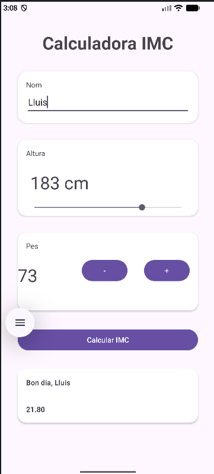

# Activitat: Calculadora IMC

Aplicació per calcular l'Índex de Massa Corporal (IMC). Permet introduir el **nom** de l'usuari, seleccionar l'**altura** (en cm) mitjançant l'slider i indicar el **pes** amb els botons d'increment i decrement. En prémer el botó **"Calcular IMC"**, es mostra una salutació personalitzada juntament amb el valor de l'IMC calculat.

> ⚠️ **Aplicació per estilar**

    

