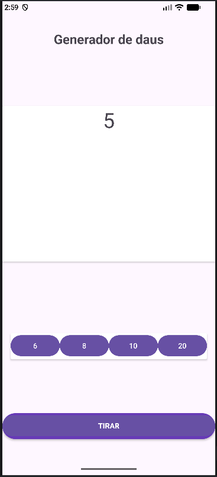

# Activitat: Llançador de daus

Aplicació amb un menú per **seleccionar quantes cares** volem que tingui el dau (6, 8, 10 o 20). Cada cop que es prem el botó **"Tirar"**, es mostra el número de la cara del dau que ha sortit.

> ⚠️ **Aplicació en desenvolupament**

    

